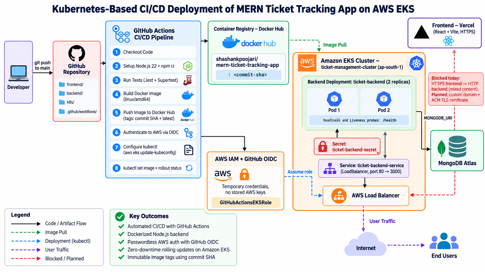
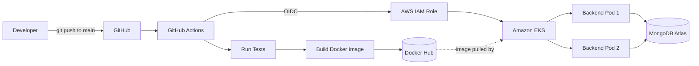
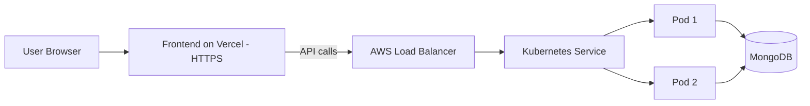
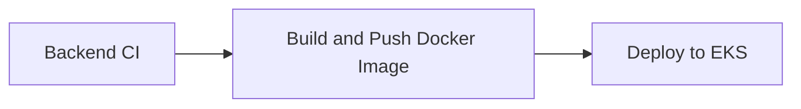

# 🎫 MERN Ticket Tracking App

A full-stack ticket tracking application built with the **MERN** stack. The backend is containerized with **Docker**, deployed on **Amazon EKS (Kubernetes)**, and shipped through a **GitHub Actions** CI/CD pipeline that authenticates to AWS using **OIDC** (no long-lived AWS keys).


---

## 📑 Table of Contents

1. [Features](#-features)
2. [Tech Stack](#-tech-stack)
3. [Architecture](#-architecture)
4. [Project Structure](#-project-structure)
5. [Prerequisites](#-prerequisites)
6. [Environment Variables](#-environment-variables)
7. [Running Locally](#-running-locally)
   - [Option A: Docker Compose (recommended)](#option-a-docker-compose-recommended)
   - [Option B: Run without Docker](#option-b-run-without-docker)
   - [Running the Frontend](#running-the-frontend)
8. [Testing](#-testing)
9. [Docker](#-docker)
10. [Kubernetes & AWS EKS Deployment](#-kubernetes--aws-eks-deployment)
11. [CI/CD Pipeline](#-cicd-pipeline)
12. [Known Limitation: Frontend ↔ Backend over HTTPS](#-known-limitation-frontend--backend-over-https)
13. [How to Enable HTTPS (Buy a Domain, Short Guide)](#-how-to-enable-https-buy-a-domain-short-guide)
14. [Useful Commands](#-useful-commands)
15. [Troubleshooting](#-troubleshooting)
16. [Cost & Cleanup](#-cost--cleanup)
17. [Roadmap](#-roadmap)
18. [License](#-license)

---

## ✨ Features

- User authentication with **JWT access and refresh tokens** (stored via cookies)
- Secure password hashing with **bcrypt**
- RESTful API built with **Express 5** and **Mongoose**
- `/health` endpoint used for Kubernetes readiness and liveness probes
- Dockerized backend with a reproducible local environment (backend + MongoDB)
- Hot-reload development setup through a Docker Compose override file
- Automated tests with **Jest** and **Supertest**
- Fully automated CI/CD: test → build image → push to Docker Hub → rolling deploy to EKS
- Zero-downtime **rolling updates** with 2 replicas

---

## 🧰 Tech Stack

| Layer | Technologies |
|---|---|
| **Frontend** | React 19, Vite 6, Redux Toolkit, React Router 7, Axios, Tailwind CSS 4, Font Awesome, React Icons |
| **Backend** | Node.js 22, Express 5, Mongoose 8, JWT (`jsonwebtoken`), `bcrypt`, `cookie-parser`, `cors`, `dotenv` |
| **Database** | MongoDB 8 (local container) / MongoDB Atlas (cloud) |
| **Testing** | Jest 30, Supertest |
| **Containers** | Docker, Docker Compose |
| **Orchestration** | Kubernetes on Amazon EKS |
| **Registry** | Docker Hub |
| **CI/CD** | GitHub Actions |
| **Cloud Auth** | AWS IAM + GitHub OIDC |
| **Frontend Hosting** | Vercel |

---

## 🏗 Architecture

### System Architecture

<p align="center">
  
</p>

<p align="center"><em>CI/CD flow: GitHub Actions → Docker Hub → Amazon EKS (via GitHub OIDC)</em></p>

### CI/CD and Deployment Flow



### Runtime Architecture



---

## 📁 Project Structure

```text
MERN-Ticket-Tracking-App/
├── .github/
│   └── workflows/
│       └── ci.yml                    # CI/CD pipeline
├── backend/
│   ├── src/
│   │   └── index.js                  # Application entry point
│   ├── Dockerfile
│   ├── package.json
│   └── .env.local                    # Local env file (NOT committed)
├── frontend/
│   ├── src/
│   ├── package.json
│   └── vite.config.js
├── k8s/
│   ├── deployment.yml                # Backend Deployment (2 replicas, probes, resources)
│   └── service.yml                   # LoadBalancer Service
├── docker-compose.yml                # Backend + MongoDB
├── docker-compose.override.yml       # Dev overrides (nodemon + bind mount)
└── README.md
```

---

## ✅ Prerequisites

### For local development

| Tool | Version | Purpose |
|---|---|---|
| [Node.js](https://nodejs.org/) | 22+ | Run backend and frontend |
| npm | 10+ (bundled with Node) | Package manager |
| [Git](https://git-scm.com/) | Latest | Source control |
| [Docker Desktop](https://www.docker.com/products/docker-desktop/) | Latest (includes Compose v2) | Containers |

> **Windows users:** the backend `test` script sets `NODE_OPTIONS` inline, which works in Git Bash / WSL / macOS / Linux but not in plain `cmd.exe`. Use Git Bash or WSL.

### For cloud deployment (EKS + CI/CD)

| Requirement | Purpose |
|---|---|
| [AWS account](https://aws.amazon.com/) | Hosts the EKS cluster |
| [AWS CLI v2](https://docs.aws.amazon.com/cli/latest/userguide/getting-started-install.html) | Authenticate and generate kubeconfig (`aws configure`) |
| [eksctl](https://eksctl.io/) | Create and delete the EKS cluster |
| [kubectl](https://kubernetes.io/docs/tasks/tools/) | Interact with the cluster |
| [Docker Hub account](https://hub.docker.com/) | Image registry + access token |
| [MongoDB Atlas account](https://www.mongodb.com/atlas) | Managed database for the cloud deployment |
| GitHub repository | Hosts code and runs Actions |
| [Vercel account](https://vercel.com/) | Frontend hosting |

---

## 🔐 Environment Variables

The backend reads the following variables:

| Variable | Description | Example |
|---|---|---|
| `PORT` | Port the server listens on | `3000` |
| `MONGODB_URI` | MongoDB connection string | `mongodb://mongodb:27017/ticket-tracker` |
| `ACCESS_TOKEN_SECRET` | Secret used to sign access tokens | long random string |
| `ACCESS_TOKEN_EXPIRY` | Access token lifetime | `15m` |
| `REFRESH_TOKEN_SECRET` | Secret used to sign refresh tokens | long random string |
| `REFRESH_TOKEN_EXPIRY` | Refresh token lifetime | `7d` |

Generate strong secrets with:

```bash
node -e "console.log(require('crypto').randomBytes(64).toString('hex'))"
```

### Local file: `backend/.env.local`

Docker Compose loads `./backend/.env.local`. Create it:

```env
PORT=3000
MONGODB_URI=mongodb://mongodb:27017/ticket-tracker
ACCESS_TOKEN_SECRET=replace_with_a_long_random_string
ACCESS_TOKEN_EXPIRY=15m
REFRESH_TOKEN_SECRET=replace_with_another_long_random_string
REFRESH_TOKEN_EXPIRY=7d
```

> In Docker Compose the database host is the **service name** (`mongodb`), not `localhost`.
> If you run the backend directly on your machine (without Docker), use `mongodb://localhost:27017/ticket-tracker` instead.

> ⚠️ **Never commit** `.env`, `.env.local`, or any file containing secrets. Make sure they are listed in `.gitignore`.

---

## 💻 Running Locally

### Clone the repository

```bash
git clone https://github.com/shashankpoojari7/MERN-Ticket-Tracking-App.git
cd MERN-Ticket-Tracking-App
```

### Option A: Docker Compose (recommended)

This starts the **backend** and a **MongoDB 8** container together. The backend waits until MongoDB passes its health check before starting.

1. Create `backend/.env.local` (see [Environment Variables](#-environment-variables)).
2. From the project root:

```bash
docker compose up --build
```

Docker Compose automatically merges `docker-compose.yml` with `docker-compose.override.yml`. In local development this means:

- the backend runs with **`npm run dev`** (nodemon, auto-restart on file changes)
- your local `./backend` folder is **bind-mounted** into the container, so code edits apply instantly
- the container's own `node_modules` is preserved through an anonymous volume

The API is available at **http://localhost:3000**.

Check it:

```bash
curl http://localhost:3000/health
```

Common Compose commands:

```bash
docker compose up -d --build     # run in the background
docker compose ps                # list containers
docker compose logs -f backend   # follow backend logs
docker compose down              # stop and remove containers
docker compose down -v           # also delete the MongoDB data volume
```

> To run Compose **without** the dev override (production-like behavior), use:
> ```bash
> docker compose -f docker-compose.yml up --build
> ```

### Option B: Run without Docker

You need a MongoDB instance (local install or an Atlas connection string).

```bash
cd backend
npm install
```

Create `backend/.env` with the variables above, then:

```bash
npm run dev     # development with nodemon
# or
npm start       # plain node
```

### Running the Frontend

```bash
cd frontend
npm install
npm run dev
```

Vite starts on **http://localhost:5173** by default.

Other frontend scripts:

```bash
npm run build     # production build into dist/
npm run preview   # preview the production build
npm run lint      # run ESLint
```

> Point the frontend's API base URL (Axios) at `http://localhost:3000` for local development.

---

## 🧪 Testing

Backend tests use **Jest** and **Supertest**.

```bash
cd backend
npm ci
npm test
```

The test script runs Jest with ES modules enabled and in-band (`--runInBand`):

```text
NODE_OPTIONS=--experimental-vm-modules jest --runInBand
```

The same command runs in the CI pipeline on every push and pull request.

---

## 🐳 Docker

### Dockerfile (`backend/Dockerfile`)

```dockerfile
FROM node:22-alpine
WORKDIR /app
COPY package.json package-lock.json ./
RUN npm ci
COPY . .
EXPOSE 3000
CMD ["npm", "start"]
```

Build and run manually:

```bash
docker build -t mern-ticket-tracking-app ./backend

docker run --env-file backend/.env.local -p 3000:3000 mern-ticket-tracking-app
```

> A standalone container needs a reachable MongoDB. Use an Atlas URI in the env file, or prefer Docker Compose.

### Docker Hub image

```text
docker.io/shashankpoojari/mern-ticket-tracking-app
```

Every push to `main` publishes two tags:

| Tag | Meaning |
|---|---|
| `<commit-sha>` | Immutable version for that exact commit (used for deployments) |
| `latest` | Most recent build from `main` |

```bash
docker pull shashankpoojari/mern-ticket-tracking-app:latest
```

---

## ☸️ Kubernetes & AWS EKS Deployment

### Kubernetes manifests

| File | Description |
|---|---|
| `k8s/deployment.yml` | Deployment `ticket-backend` with **2 replicas**, secrets via `envFrom`, readiness and liveness probes on `/health`, CPU/memory requests and limits |
| `k8s/service.yml` | Service `ticket-backend-service` of type **LoadBalancer** exposing port **80** → container port **3000** |

Key settings in the Deployment:

| Setting | Value |
|---|---|
| Replicas | 2 |
| Container port | 3000 |
| Readiness probe | `GET /health`, delay 5s, every 10s |
| Liveness probe | `GET /health`, delay 15s, every 20s |
| Resources (requests) | 100m CPU / 128Mi memory |
| Resources (limits) | 500m CPU / 512Mi memory |
| Config source | Secret `ticket-backend-secret` |

### One-time setup

#### 1. Configure the AWS CLI

```bash
aws configure
# Region: ap-south-1
```

#### 2. Create the EKS cluster

```bash
eksctl create cluster \
  --name ticket-management-cluster \
  --region ap-south-1 \
  --nodegroup-name standard-workers \
  --node-type t3.small \
  --nodes 2
```

This takes roughly 15–20 minutes. Nodes are `amd64`, which matches the image built by CI (`linux/amd64`).

#### 3. Connect `kubectl` to the cluster

```bash
aws eks update-kubeconfig --region ap-south-1 --name ticket-management-cluster
kubectl get nodes
```

#### 4. Create the Kubernetes Secret

The Deployment loads all environment variables from a Secret named `ticket-backend-secret`.

Create a production env file (for example `backend/.env.production`, never commit it) using your **Atlas** connection string:

```env
PORT=3000
MONGODB_URI=mongodb+srv://<user>:<password>@<cluster>.mongodb.net/ticket-tracker
ACCESS_TOKEN_SECRET=...
ACCESS_TOKEN_EXPIRY=15m
REFRESH_TOKEN_SECRET=...
REFRESH_TOKEN_EXPIRY=7d
```

> ⚠️ For `--from-env-file`, **do not wrap values in quotes**. Kubernetes would store the quotes as part of the value.

```bash
kubectl create secret generic ticket-backend-secret \
  --from-env-file=backend/.env.production

kubectl get secrets
```

To update a secret later:

```bash
kubectl delete secret ticket-backend-secret
kubectl create secret generic ticket-backend-secret --from-env-file=backend/.env.production
kubectl rollout restart deployment/ticket-backend
```

#### 5. MongoDB Atlas network access

In Atlas → **Network Access**, allow connections from your EKS nodes' outbound IP (or `0.0.0.0/0` for learning purposes only; restrict it in production).

#### 6. First deployment

```bash
kubectl apply -f k8s/deployment.yml
kubectl apply -f k8s/service.yml

kubectl get deployment
kubectl get pods -o wide
kubectl get service ticket-backend-service
```

Wait until the `EXTERNAL-IP` column shows an AWS load balancer hostname, then test:

```bash
curl http://<LOAD-BALANCER-HOSTNAME>/health
```

> **Note:** `deployment.yml` references the `:latest` tag. After the first manual apply, the CI pipeline updates the image to the **commit SHA** tag using `kubectl set image`. Re-applying `deployment.yml` by hand will reset the image to `latest`.

### Rollout commands

```bash
kubectl rollout status deployment/ticket-backend
kubectl rollout history deployment/ticket-backend
kubectl rollout undo deployment/ticket-backend     # roll back to the previous version
```

---

## 🔄 CI/CD Pipeline

Workflow file: `.github/workflows/ci.yml` (workflow name: **Ticket APP CI**)

### Triggers

| Event | Behavior |
|---|---|
| Push to `main` | Runs **all three jobs** (test → build/push → deploy) |
| Pull request to `main` | Runs **tests only** |
| Changes only in `README.md` or `docs/**` | Workflow **does not run** (`paths-ignore`) |

```yaml
on:
  push:
    branches: [main]
    paths-ignore:
      - "README.md"
      - "docs/**"
  pull_request:
    branches: [main]
    paths-ignore:
      - "README.md"
      - "docs/**"
```

A commit that changes `README.md` **and** other files (for example `backend/src/index.js`) still triggers the pipeline.

### Jobs



| # | Job | Runs on | What it does |
|---|---|---|---|
| 1 | **Backend CI** | push + PR | Checkout → Node 22 (npm cache) → `npm ci` → `npm test` in `backend/` |
| 2 | **Build and Push Docker Image** | push to `main` only | Buildx → Docker Hub login → build `./backend` for `linux/amd64` → push `:<sha>` and `:latest` |
| 3 | **Deploy to EKS** | push to `main` only | Assume AWS role via OIDC → `aws eks update-kubeconfig` → `kubectl set image` with the commit SHA → wait for rollout |

### Required GitHub Secrets

Go to **Repository → Settings → Secrets and variables → Actions → New repository secret**:

| Secret | Value |
|---|---|
| `DOCKERHUB_USERNAME` | Your Docker Hub username |
| `DOCKERHUB_TOKEN` | Docker Hub access token (Account Settings → Security → New Access Token) |
| `AWS_ROLE_ARN` | ARN of the IAM role GitHub Actions assumes, e.g. `arn:aws:iam::<ACCOUNT_ID>:role/GitHubActionsEKSRole` |

### One-time AWS OIDC setup

GitHub Actions authenticates to AWS with short-lived credentials. No AWS access keys are stored in GitHub.

**1. Create the OIDC identity provider** (IAM → Identity providers → Add provider)

- Provider type: **OpenID Connect**
- Provider URL: `https://token.actions.githubusercontent.com`
- Audience: `sts.amazonaws.com`

**2. Create the IAM role** `GitHubActionsEKSRole` with this **trust policy**:

```json
{
  "Version": "2012-10-17",
  "Statement": [
    {
      "Effect": "Allow",
      "Principal": {
        "Federated": "arn:aws:iam::<ACCOUNT_ID>:oidc-provider/token.actions.githubusercontent.com"
      },
      "Action": "sts:AssumeRoleWithWebIdentity",
      "Condition": {
        "StringEquals": {
          "token.actions.githubusercontent.com:aud": "sts.amazonaws.com"
        },
        "StringLike": {
          "token.actions.githubusercontent.com:sub": "repo:shashankpoojari7/MERN-Ticket-Tracking-App:ref:refs/heads/main"
        }
      }
    }
  ]
}
```

**3. Attach a permissions policy** allowing the role to describe the cluster:

```json
{
  "Version": "2012-10-17",
  "Statement": [
    {
      "Effect": "Allow",
      "Action": "eks:DescribeCluster",
      "Resource": "arn:aws:eks:ap-south-1:<ACCOUNT_ID>:cluster/ticket-management-cluster"
    }
  ]
}
```

**4. Grant the role access inside Kubernetes.** IAM permissions alone are not enough; the role must be mapped to a Kubernetes identity.

Using EKS access entries (recommended for new clusters):

```bash
aws eks create-access-entry \
  --cluster-name ticket-management-cluster \
  --region ap-south-1 \
  --principal-arn arn:aws:iam::<ACCOUNT_ID>:role/GitHubActionsEKSRole

aws eks associate-access-policy \
  --cluster-name ticket-management-cluster \
  --region ap-south-1 \
  --principal-arn arn:aws:iam::<ACCOUNT_ID>:role/GitHubActionsEKSRole \
  --policy-arn arn:aws:eks::aws:cluster-access-policy/AmazonEKSClusterAdminPolicy \
  --access-scope type=cluster
```

> `AmazonEKSClusterAdminPolicy` is convenient for learning. For production, scope it down to the namespace and permissions the deploy job actually needs.

---

## ⚠️ Known Limitation: Frontend ↔ Backend over HTTPS

**Currently the deployed frontend cannot talk to the deployed backend.**

| Component | Protocol |
|---|---|
| Frontend (Vercel) | **HTTPS** |
| Backend (EKS LoadBalancer) | **HTTP** only (`http://<elb-hostname>`) |

Browsers block requests from an HTTPS page to an HTTP API (**mixed content**), so API calls from the Vercel-hosted frontend fail. The AWS-generated load balancer hostname (`*.elb.amazonaws.com`) cannot get a TLS certificate because you do not own that domain.

What still works today:

- Backend on EKS: reachable over HTTP via `curl` / Postman, health checks, CI/CD, rolling updates
- Frontend + backend together **locally** (`http://localhost:5173` → `http://localhost:3000`)

To connect them in production you need **a custom domain and a TLS certificate**. See the next section.

---

## 🌐 How to Enable HTTPS (Buy a Domain, Short Guide)

### Step 1: Buy a domain

Any registrar works: **Amazon Route 53**, Namecheap, GoDaddy, Cloudflare, or Hostinger. A `.com` costs roughly $10–15/year; cheaper TLDs such as `.xyz` or `.in` are also fine for a project.

### Step 2: Choose an API subdomain

Example: `api.yourdomain.com`

### Step 3: Request a free TLS certificate (AWS ACM)

1. AWS Console → **Certificate Manager** → region **ap-south-1** → **Request certificate**
2. Domain name: `api.yourdomain.com`
3. Validation: **DNS validation**
4. Add the CNAME record ACM shows you at your registrar (or click *Create records in Route 53*)
5. Wait until status becomes **Issued** and copy the certificate ARN

### Step 4: Add TLS annotations to the Service

Edit `k8s/service.yml`:

```yaml
apiVersion: v1
kind: Service
metadata:
  name: ticket-backend-service
  annotations:
    service.beta.kubernetes.io/aws-load-balancer-ssl-cert: arn:aws:acm:ap-south-1:<ACCOUNT_ID>:certificate/<CERT_ID>
    service.beta.kubernetes.io/aws-load-balancer-ssl-ports: "443"
    service.beta.kubernetes.io/aws-load-balancer-backend-protocol: http
spec:
  type: LoadBalancer
  selector:
    app: ticket-backend
  ports:
    - name: https
      protocol: TCP
      port: 443
      targetPort: 3000
```

```bash
kubectl apply -f k8s/service.yml
kubectl get service ticket-backend-service   # copy the new EXTERNAL-IP hostname
```

> This is the simplest approach (TLS terminates at the AWS load balancer). The more scalable alternative is installing the **AWS Load Balancer Controller** and using a Kubernetes **Ingress** with an ALB.

### Step 5: Point the domain to the load balancer

At your DNS provider, create:

| Type | Name | Value |
|---|---|---|
| `CNAME` | `api` | `<load-balancer-hostname>.ap-south-1.elb.amazonaws.com` |

(In Route 53 you can use an **Alias A record** instead.)

Verify:

```bash
curl https://api.yourdomain.com/health
```

### Step 6: Update frontend and backend configuration

1. In **Vercel → Project → Settings → Environment Variables**, set your API base URL to `https://api.yourdomain.com` and redeploy.
2. Update the backend **CORS** configuration to allow your frontend origin (e.g. `https://your-app.vercel.app`) with `credentials: true`.
3. Because the app uses cookies across two different sites, set cookies with `secure: true` and `sameSite: "none"`, and send requests with Axios `withCredentials: true`.
   (Alternatively, put the frontend on `app.yourdomain.com` so both share the same site and `sameSite: "lax"` works.)

---

## 🛠 Useful Commands

```bash
# Cluster
kubectl get nodes
kubectl get pods -A

# Workloads
kubectl get deployments
kubectl get pods -o wide
kubectl get services
kubectl describe pod <pod-name>

# Logs
kubectl logs -l app=ticket-backend
kubectl logs <pod-name> -f

# Rollouts
kubectl rollout status deployment/ticket-backend
kubectl rollout restart deployment/ticket-backend
kubectl rollout undo deployment/ticket-backend

# Verify which image is running
kubectl get deployment ticket-backend -o jsonpath='{.spec.template.spec.containers[0].image}'
```

---

## 🩺 Troubleshooting

| Problem | Likely cause / fix |
|---|---|
| Pods in `CrashLoopBackOff` | Run `kubectl logs <pod>`. Usually a wrong `MONGODB_URI` or missing secret key. |
| `CreateContainerConfigError` | Secret `ticket-backend-secret` does not exist. Create it first. |
| Pods running but not `Ready` | `/health` is failing. Check logs and probe path/port (3000). |
| `ImagePullBackOff` | Image tag does not exist in Docker Hub, or the repo is private without an image-pull secret. |
| Service `EXTERNAL-IP` stuck on `<pending>` | Wait a few minutes; check `kubectl describe service ticket-backend-service` and your subnet/VPC setup. |
| Deploy job: `Unauthorized` / `You must be logged in to the server` | The IAM role is not mapped in EKS. Create the access entry (see OIDC step 4). |
| Deploy job: `Not authorized to perform sts:AssumeRoleWithWebIdentity` | Trust policy `sub` does not match your repo/branch, or the OIDC provider is missing. |
| MongoDB connection fails from EKS | Atlas Network Access does not allow the cluster's IP, or credentials contain unescaped special characters. |
| Backend cannot reach MongoDB in Compose | `MONGODB_URI` must use host `mongodb`, not `localhost`. |
| Code changes not reflected in Compose | Confirm `docker-compose.override.yml` exists and you ran `docker compose up` (not `-f docker-compose.yml`). |
| `npm test` fails on Windows | Use Git Bash or WSL (inline `NODE_OPTIONS` syntax). |
| Frontend requests blocked in browser | Mixed content (HTTPS → HTTP). See [Known Limitation](#-known-limitation-frontend--backend-over-https). |

---

## 💰 Cost & Cleanup

An EKS cluster, EC2 nodes, and the AWS load balancer **incur charges while they exist**, even when idle.

When you are done:

```bash
# Remove the load balancer first
kubectl delete -f k8s/service.yml

# Then delete the cluster and nodes
eksctl delete cluster --name ticket-management-cluster --region ap-south-1

# Confirm nothing is left
eksctl get cluster --region ap-south-1
```

Also check the AWS console for leftover load balancers, volumes, and Elastic IPs.

---

## 🗺 Roadmap

- [ ] Custom domain + HTTPS for the backend and full frontend ↔ backend integration
- [ ] Containerize and deploy the frontend
- [ ] Ingress with AWS Load Balancer Controller
- [ ] Horizontal Pod Autoscaler
- [ ] Helm chart or Kustomize overlays
- [ ] Infrastructure as Code (Terraform)
- [ ] Frontend tests and lint step in CI

---

## 📄 License

This project is for learning and development purposes.

**Author:** [Shashank Poojari](https://github.com/shashankpoojari7)
